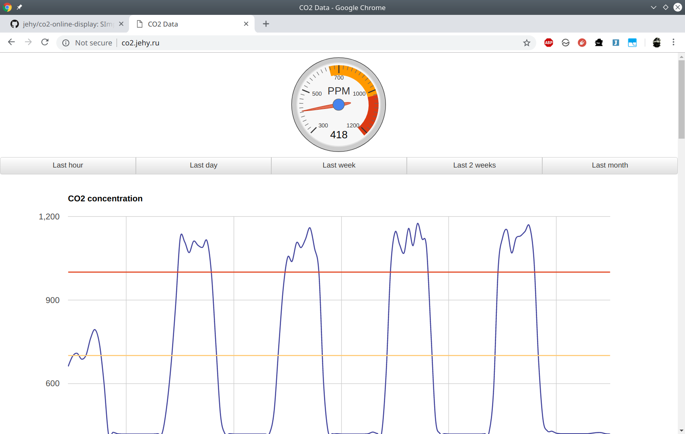

# co2-online-display
Simple web app to display CO2 data from  [arduino-esp8266-mhz-19-serial project](https://github.com/jehy/arduino-esp8266-mhz-19-serial).

Requires PHP and MySQL.

You can check it online [here](http://co2.jehy.ru/) (data may be not 
available if my sensor is offline today).

# Installation

1. Run script `co2.sql` in your database to create table.
2. Copy file `db.inc.sample` to `db.inc` and put there your database credentials.
3. Reconfigure your arduino device to use your host.
3. Enjoy!
